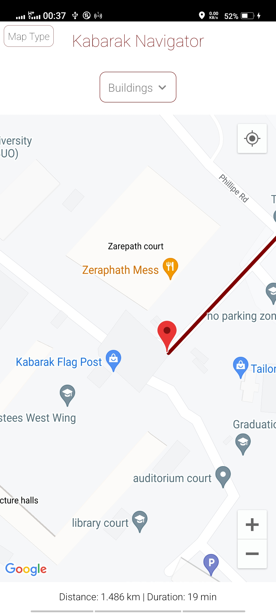
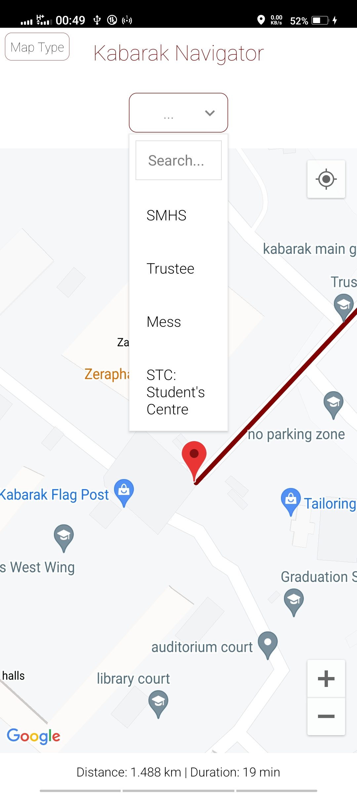
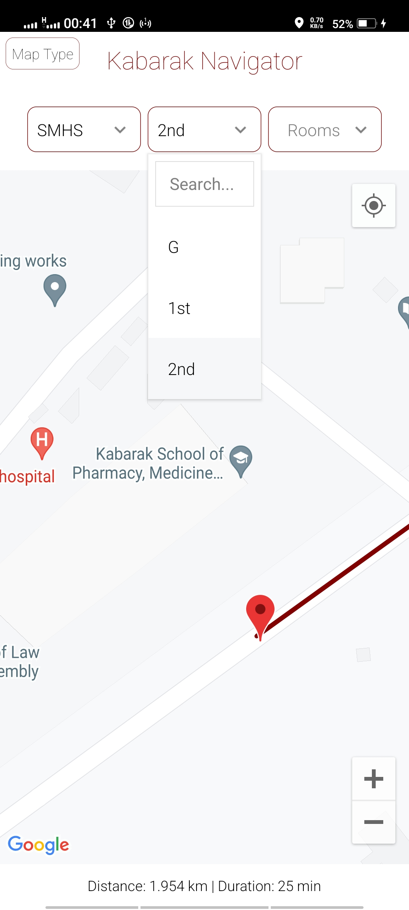
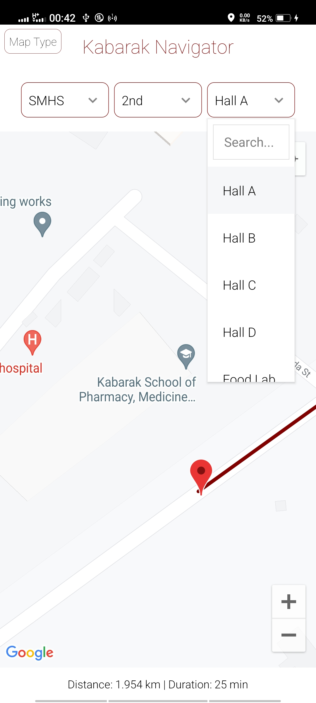
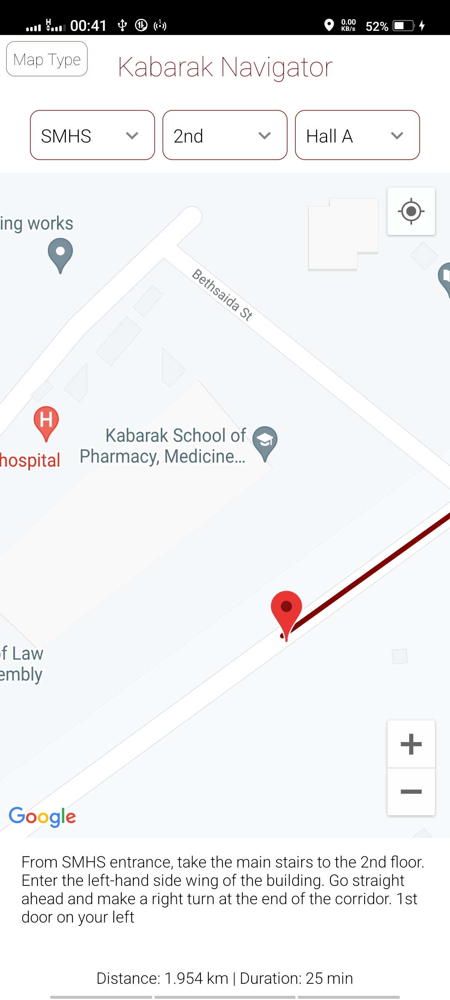
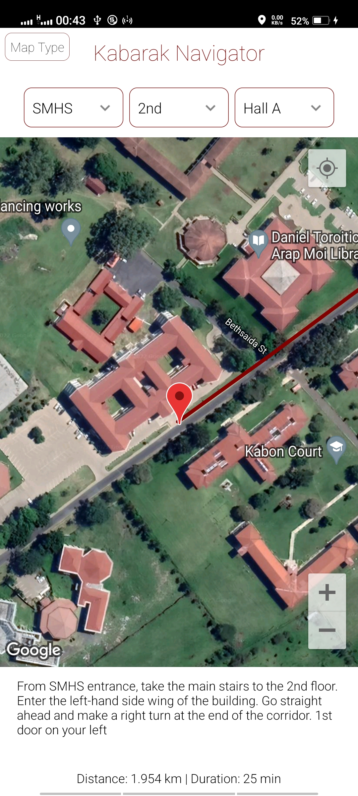
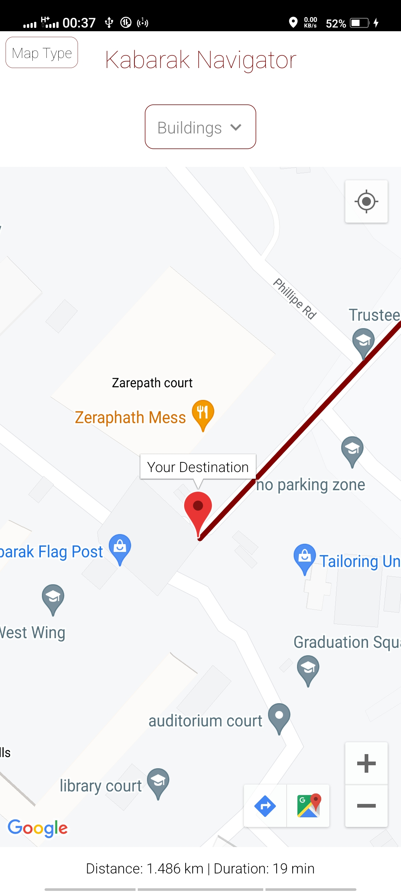
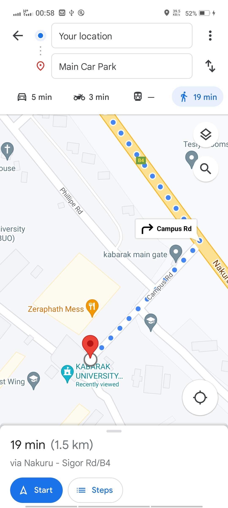

# Kabarak Navigator

##### A Navigation System for Kabarak University

###### The system can acheieve the following objectives:

- Locate where specific buildings, classes and offices are in the school.
- Estimate the distance of where the user is heading to and how long it will take for them to get there.
- Guides the users on the routes to follow to get to a specific place in the school.

##### Technologies Used:

- **React-Native**
  A web framework for building Progressive Web Apps. This framework is capable of producing cross-platform mobile applications such that the navigation system will accomodate both android and ios users.

- **Google Maps API**
  The API facilitated rendering of the map in the navigation system as most major buildings in the school are covered in the map.

- **Third Party Libraries**
  - **_react-native-maps-api_**
    This library component provided components which facilitated rendering of the map on a react-native View.
    It also provided components for destination markers on the map.
  - **_react-native-maps-directions_**
    This library facilitated the stroke component between user's current location to desired destination using a Mapdirections component.
  - **_react-native-dropdowns_**
    This library provided Dropdown components for the Bildings, Floors and Rooms for the user interface.
  - **_react-native-geolocation-service_**
    This library, utilizes the Google Maps API to fetch the user's current location (coordinates) and render it on the MapView.

### Usage:

A user selects a building (destination) from the available dropdown. The default destination has been set to the main car park.
Upon selecting a building from the dropdown list, the Map view updates and indicates a highlighted path from the user's current location to the selected destination.
A user then selects a desired floor from the dropdown list for the already selected building.
A user finally selects a room from the dropdown list, after which a description is provided from the building entrance.

### Demo shown below:

- The starup screen.  
    
- The user selects a desired building (destination). 
    
- The user selects a floor in the selected bilding. 
    
- The user selects a room on the floor. 
    
- Directions to the specified room are generated via a description text. 
    

### Additional Functionality

- A user can click on the Map Type button to change between satellite view and standard map view 
    

- A user can click on the destination marker for the option of using google maps to navigate to their desired location. 
     
